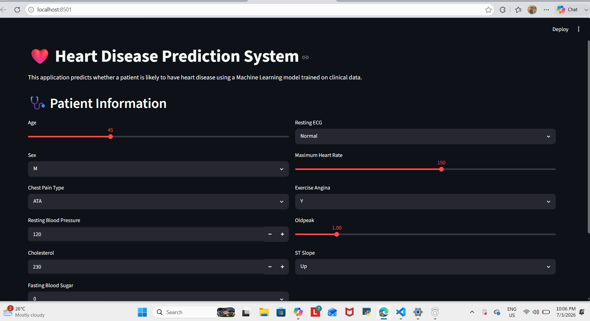

# ❤️ Heart Disease Prediction using Machine Learning

A Machine Learning project that predicts the likelihood of heart disease using patient clinical data. The project compares multiple classification algorithms, evaluates their performance, and deploys the best-performing model through an interactive Streamlit web application.


## 📑 Table of Contents

- Application Preview
- Features
- Dataset
- Technologies Used
- Project Structure
- Machine Learning Workflow
- Model Performance
- Installation
- Running the Application
- Future Improvements
- Author
- License

## 📸 Application Preview

> **Screenshot coming soon**

<!-- Replace this with your screenshot later -->
<!

-->

## ✨ Features

- 📊 Exploratory Data Analysis (EDA)
- 🧹 Data Cleaning and Preprocessing
- 🔄 Feature Encoding and Scaling
- 🤖 Multiple Machine Learning Models
  - Logistic Regression
  - K-Nearest Neighbors (KNN)
  - Decision Tree
  - Random Forest
  - Support Vector Machine (SVM)
  - XGBoost
- 🎯 Hyperparameter Tuning using GridSearchCV
- 🔁 10-Fold Cross Validation
- 📈 Model Performance Comparison
- 📉 Confusion Matrix
- 📊 ROC Curve Analysis
- 💾 Model Saving using Joblib
- 🌐 Interactive Streamlit Web Application

## 📂 Dataset

The project uses the **Heart Disease Prediction Dataset** from Kaggle/UCI Machine Learning Repository.

The dataset contains patient clinical information including:

- Age
- Sex
- Chest Pain Type
- Resting Blood Pressure
- Cholesterol
- Fasting Blood Sugar
- Resting ECG
- Maximum Heart Rate
- Exercise-Induced Angina
- Oldpeak
- ST Slope

Target Variable:

- **HeartDisease**
  - 0 = No Heart Disease
  - 1 = Heart Disease

## 🛠️ Technologies Used

### Programming Language

- Python

### Libraries

- Pandas
- NumPy
- Matplotlib
- Seaborn
- Scikit-learn
- XGBoost
- Joblib
- Streamlit

### Development Environment

- Visual Studio Code
- Jupyter Notebook

## 📁 Project Structure

```text
Heart-Disease-Prediction/
│
├── app/
│   └── app.py
│
├── data/
│   └── heart.csv
│
├── images/
│
├── models/
│   └── heart_disease_pipeline.pkl
│
├── notebooks/
│   └── Heart_Disease_Prediction.ipynb
│
├── src/
│   ├── train.py
│   ├── predict.py
│   └── utils.py
│
├── requirements.txt
├── README.md
├── .gitignore
└── LICENSE
```

## 🤖 Machine Learning Workflow

1. Load Dataset
2. Perform Exploratory Data Analysis (EDA)
3. Clean the Dataset
4. Encode Categorical Features
5. Scale Numerical Features
6. Split Data into Training and Testing Sets
7. Train Multiple Machine Learning Models
8. Tune Hyperparameters
9. Perform Cross Validation
10. Compare Model Performance
11. Select the Best Model
12. Deploy the Model using Streamlit

## 📊 Model Performance

| Model                        | Accuracy |
| ---------------------------- | -------- |
| Logistic Regression          | 0.85     |
| KNN                          | 0.84     |
| Decision Tree                | 0.76     |
| Random Forest                | 0.87     |
| **Support Vector Machine ⭐** | **0.88** |
| XGBoost                      | 0.84     |


## ⚙️ Installation

Clone the repository:

```bash
git clone https://github.com/YOUR_USERNAME/Heart-Disease-Prediction.git
```

Navigate to the project:

```bash
cd Heart-Disease-Prediction
```

Install the required packages:

```bash
pip install -r requirements.txt
```

## ▶️ Run the Application

Train the model:

```bash
python src/train.py
```

Run the Streamlit app:

```bash
streamlit run app/app.py
```
## 🚀 Future Improvements

- Deploy the application online using Streamlit Community Cloud
- Add SHAP Explainability
- Support batch predictions from CSV files
- Improve the user interface
- Add model monitoring and logging

## 👨‍💻 Author

**HOZIFA MOHAMED**

- GitHub: https://github.com/YOUR_USERNAME
- LinkedIn: https://www.linkedin.com/in/YOUR_LINKEDIN